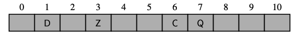
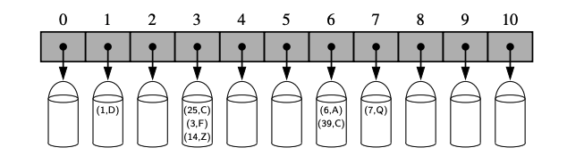
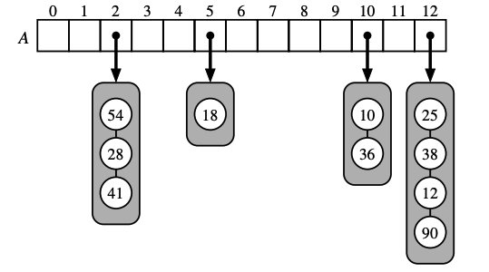
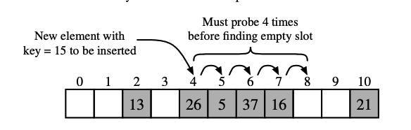

# Maps, Hash Tables, and Skip Lists

## Maps and Dictionaries:

Python's **dict** class represents an abstraction known as a dictionary, in which unique **keys** are mapped to associated **values**. They are also commonly known as **associative arrays** or **maps**.

An example, illustrates a map from the names of countries to their associated units of currency:

| Country | Currency |
| --- | --- |
| Turkey | Lira |
| Spain | Euro |
| Greece | Euro |
| China  | Yuan |
| United States  | Dollar |
| India | Rupee |

**Note:** The keys (country names) are assumed to be unique, but the values (currency units) are not necessaily unique. Unlike a stadard array, indices for a map need to be consecutive nor even numeric.

The map may be implemented so that a search for a key, and its associated value can be preformed very efficiently, thereby supporting fast lookup in such applications.

### The Map ADT:

Signifigant behaviors of a map *M*:

| Syntax | Behaviour |
| --- | --- |
| `M[K]` | Return the value `v` associated with a key `k` in map `M`, if one exists; otw raise a `KeyError`. |
| `M[k] = v` | Associate value `v` with a key `k` in map `M`, replacing the existing value if the map already contains an item with key equal to `k`. |
| `del M[k] ` | Remove from map `M` the item with key equal to `k`; if `M`has no such item, then raise a `KeyError`. |
| `len(M)` | Return the number of items in map `M`. |
| `iter(M)` | The defualt iteration for a map generates a sequence of *keys* in the map. It allows for a loop of the form, `for k in M`. |

### Counting Word Frequencies:

*Goal:* Count how many times each word appears in a document.

Key Concepts:
- Use a dictionary (map) to store: `{word: count}`.
- Ignore punctuation and non-alphabetic characters.
- Covert entire document to lowercase
- Split into words using the `.split()` on white space.

```.py
freq = {}
for piece in open(filename).read().lower().split():
    word = ''.join(c for in c in piece if c.isalpha()) # only conider aplhabetic characters within this piece
    if word: # require atleast one alphabetic character
        freq[word] = 1 + freq.get(word, 0) # increment count in dict
```

With this you can now look through `freq` dictionary to find word frequency, ex. max word frequency

## Hash Tables

A hash table is a fundemental data structure for implementing a **map (or dictionary)**. Python's built in `dict` is based on a hash table. It allows fast-access to data  using keys via syntax like `M[k]`.

Conceptual Warm-up:
- Imagine keys are integers in the range `0` to `N-1`, for some large `N`
- We can represent the map using a lookup table (array) of length `N`, where the index corresponds to the key.
- Example: A lookup tabe of length 11 storing (1,D), (3,Z), (6,C), (7,Q). Values would be stored directly at the index corresponding to the key.



- Operations like `__get__item`, `__setitem__`, and `__delitem__` can be done in *O(1)* worst-case time in this setup.

**Limitations of Direct Lookup Table:**
1. Storage inefficiency if `N >> n` there is too much unused space.
2. Keys in maps are not necessarily integers.

**Solution? (Hash Tables):**
- Use a hash function to map any key to an integer index in `[0, N-1]`.
- Goal: Distribute keys evenly across the array to avoid clustering.
- Resulting structure bucket array. (Figure coming...)

**Collisions and Buckets:**
- Different keys may hash to the same index -> this is a collision.
- Resolve collisions by having buckets at each index.
    - Each bucket is a collection (eg a list or linked lists of key-value pairs)
    - Example: Bucket at index 4 holds [(25, C), (3, F), (14, Z)]



### Hash Functions:

**Hash Function:** A hash function *h*, maps each key *k* to an integer in the range *[0, N-1]*, where *N* is the capacity of the bucket array for a hash table.

The main idea is that with such a *hash function*, we use the hash function value *h(k)*, as an index into our bucket array, *A*, instead of the key*k*, That is we store the item *(k, v)* in the bucket *A[h(k)]*.

**Collision:** If there are two or more keys with the same hash value, then two different items will be mapped to the same bucket *A*. In this case, we say that a collision has occured.

Good hash functions minimize collisions and are fast to compute.

The hash function, *h(k)* is commonly broken down into a two part process.
1. Hash Code: Converts key to an integer.
2. Compression Function: Maps that integer to *[0, N-1]*

### Hash Codes:

We desire that the set of hash codes assigned to our keys should avoid collisions as much as possible (this is because if the hash codes of our keys cause collisions, then there is no hope for our compression function to avoid them).

Bit Interpretation:
- Keys (eg. 314, 3.14, etc) can be interpreted as integers from their binary represnetation.
- For longer keys, compress high and low 32 bits, using exculusive or, or summing and ignoring overflow.
- Bit interpretation is not the best hash code approach as it causes lots of unwanted collisions for common groups of strings. Notice that it doesn't really take into account the ordering of characters thus using this function would result in collisions for `stop`, `tops`, `pots`, etc. A better hash code should take into consideration the position of the $x_i$'s.

Polynomial Hash Code:
- Treat key as a tuple of components (eg. characters) and compute:
$$x_0a^{n-1} + x_1a^{n-2} + ... + x_{n-2}a + x_{n-1}$$ 
- Multiplies each component by a power of constant *a* (commonly 33, 37, 39, or 41).
- Helps reduce clustering and distrubtes values well. This should be intuitive since multiplication by different powers is used as a way to spread out the influence of each component across the resulting hash code.

Cyclic-Shift Hash Codes:
- Use bitwise shifts to mix values.
```.py
def hash_code(s):
    mask = (1 << 32) - 1 #gives a mask of 32 1's
    h = 0
    for character in s:
        # h << 5 moves bits 5 places to the left, the mask makes sure that the lower 32 bits are kept only. 
        # h >> 27 brings out the top 5 bits (which weere shifted out back around to the right side). 
        # | puts these two parts together, simulating a left rotate by 5 bits.
        h = (h << 5 & mask) | (h >> 27) 
        h += ord(character)
    return h
```
### Hash Codes in Python:
- `hash(x)` is Python's in built hash function.
- Only immutable types are hashable (eg. `int`, `str`, `tuple`, `frozenset`).
- Custom classes can define `__hash__()` using immutable fields.
- Hash must be consistent with `__eq__()`, ie. `x == y` $\implies$ `hash(x) == hash(y)`

### Compression Functions:

Purpose: Convert arbitrary integer hash code to bucket index: *[0, N-1]*.

The Division Method:
- Map an integer to $i \mod N$, where *N* is the size of the bucket array, is a fixed positive integer.
- Additionally if we take *N* to be a prime number, then this compression function helps "spread out" distribution of hashed values.

The MAD Method:
- The **Division Method** will have problems w/ inputs that are sequenced/patterned. ie. in the form of $pN+q$ for fixed q, (counting by q's), will lead to many collisions.
- the **MAD** method or **Multiply-Add-and-Divide** method maps an integer*i* to $[(ai+b) \mod p] \mod N$, w/ $N$ as the size of the bucket array, $p$ is a prime number largern than $N$, and $a$ and $b$ are integers chosen at random from the interval $[0, p-1]$, $a>0$. 

### Collision-Handling Schemes:

Seperate Chaining:

- Each bucket $A[j]$ holds a secondary structure (eg. list) of $(k,v)$ pairs.

Here is an example:



*A hash table of size 13, storing 10 items with integer keys, with collisions resolved by seperate chaining. For simplicity, we do not show the values associated with the keys.*

- In the worst case, operations on a individual bucket take time proportional to the size of the bucket. Assuming a good hash function to index the $n$ items in our map of bucket array capacity $N$, the expected size of a bucket is $n/N$. Thus, assuming a good hash function core operations run in $O(\lceil n/N \rceil)$, this ratio $\lambda = n/N$ is called the **Load Factor**.

- The load factor should be bounded by a small constant; preferably less than 1. As long as $\lambda$ is $O(1)$; then core operations on the hash table run in $O(1)$ expected time.

### Open Addressing:

- Separate chaining rule has its advantages, but it requires an auxiliary data structure (a list) to hold ites with colliding keys. What if we use the alternative approach of always storing each item directly in a table slot? There are variats of this approach, collectively refered to as **open adressing*. 

Variants:

1. Linear Probing: Probe $a[(h(k) + i) \mod n]$
    - If we try to insert an item $(k,v)$ into a bucket $A[j]$ that is already occupied, where $j = h(k)$, then we next try $a[(j+1) \mod n]$; if $a[(j+1) \mod n] is also occupied, then we try $a[(j+2) \mod n]$, and so on until we find an empty bucket that can accept the new item. once this bucket is located; we simply insert the item there.  


*Inserstion into a hash table with integer keys using linear probing, values associated with keys are not shown.**

- Linear probing tends to cluser the items of a map into contiguous runs, which can cause searches to slow considerably. This is known as **primary clustering**.

2. Quadratic Probing:
    - Probe $a[(h(k)+i^2) \mod n]$, same idea as before but quadratically look at next open block.
    - Spread out more than linear probing, but... still suffers from a similar problem (albeit less) known as **secondary clustering**.

    
